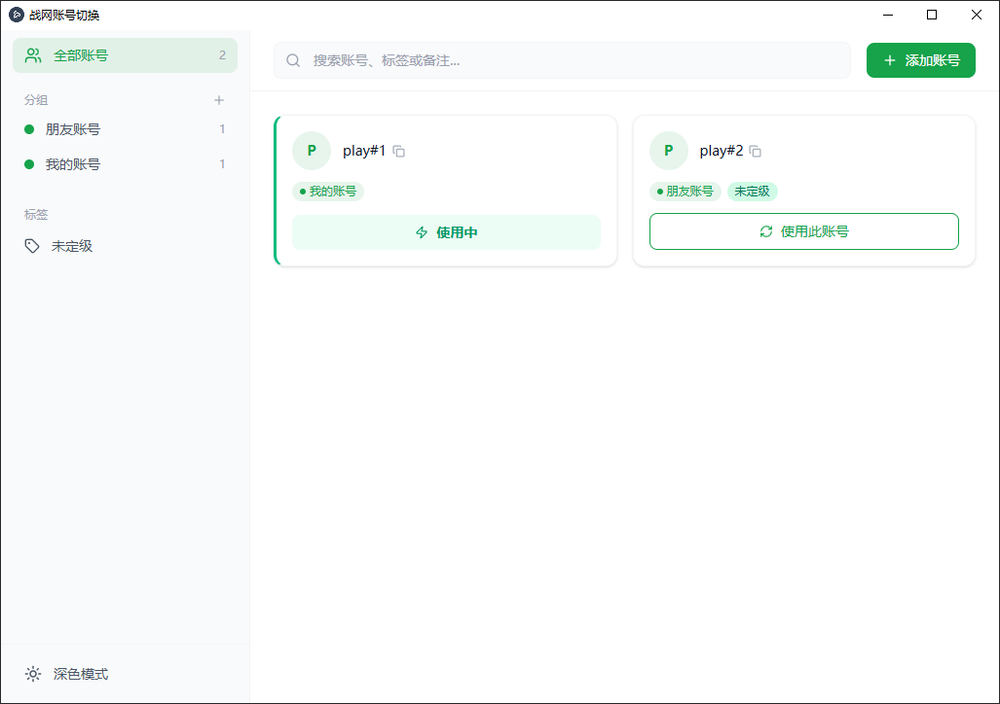

English | [中文](README_zh.md)

# BattleNetManager — Battle.net Account Switcher



> ⚠️ This software is independently developed by a third party and is not affiliated with, endorsed by, or authorized by Blizzard Entertainment or NetEase.

Standing on the shoulders of giants — this project was inspired by [KManager](https://github.com/kingkideng/KManager)

## Download

Head to the [Releases](https://github.com/track23/battle-net-manager/releases/latest) page to download the latest installer.

## Overview

BattleNetManager is a lightweight Windows desktop app for players who manage multiple **Battle.net** accounts. Switch between accounts seamlessly with one click — no need to re-enter credentials every time.

### Features

- **Account Management** — Add, edit, and delete multiple Battle.net accounts
- **Group Management** — Organize accounts into groups for quick access
- **One-Click Switching** — Automatically applies the correct configuration, no manual file editing required
- **Process Management** — Detects and handles running Battle.net clients before switching
- **Multi-Language** — Supports English and Chinese, auto-detects based on system language

## Why BattleNetManager?

- **🪶 Lightweight** — Built with Tauri, the installer is only a few MB
- **🔒 Open Source & Safe** — Fully open source, no backdoors, no telemetry, no ads — audit welcome
- **💾 Local Storage** — All account data and config files are stored locally, never uploaded to any server

## Tech Stack

| Layer          | Technology                |
| -------------- | ------------------------- |
| Frontend       | SolidJS + Tailwind CSS v4 |
| Desktop Shell  | Tauri 2.0                 |
| Backend        | Rust                      |
| Packaging      | NSIS (Windows Installer)  |

## Development

### Prerequisites

- Node.js 20+
- Rust 1.70+ (Windows MSVC toolchain)
- Windows x64

### Frontend Dev (Browser)

```bash
cd webui
npm install
npm run dev
```

Open `http://localhost:1420` in your browser. MockBridge provides simulated data for UI development.

### Full Dev (Tauri Desktop)

```bash
cd src-tauri
cargo tauri dev
```

### Production Build

```bash
cd src-tauri
cargo tauri build
```

Build output is at `src-tauri/target/release/bundle/`.

## License

[MIT](LICENSE)
